# King Cobra Study

A king cobra lit like a sculpture in a dark studio. The line drawing is traced into SVG, so every scale is its own block. WebGL2 then gives each block real depth and light. The scene keeps changing for an hour or more without repeating.

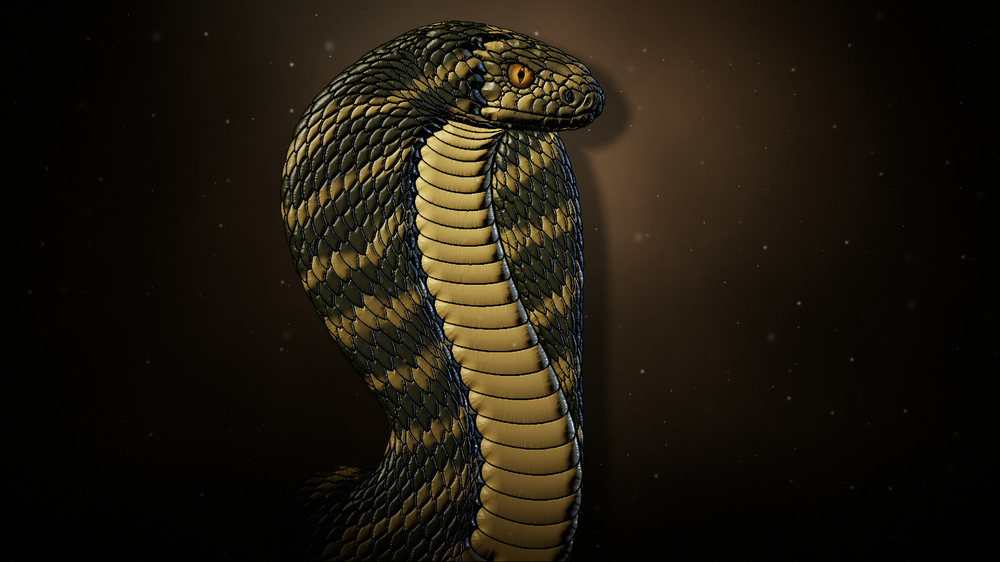

## Looks

The snake slowly changes material every 3–5 minutes.

| 王蛇 · natural king cobra | 黑曜石 · obsidian | 青铜 · bronze |
| --- | --- | --- |
|  | 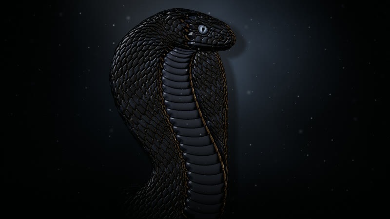 | 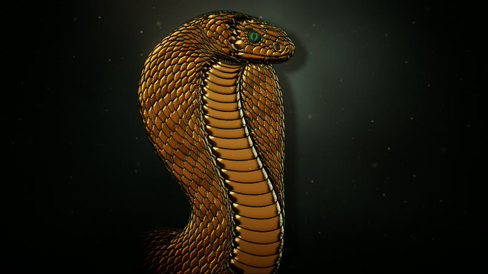 |
| **翡翠 · jade** | **青花 · blue-and-white porcelain** | **鎏金 · gold** |
| 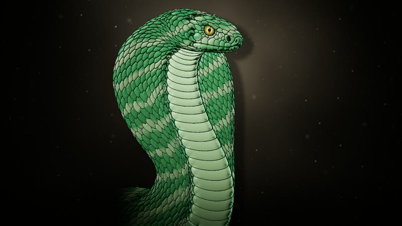 | 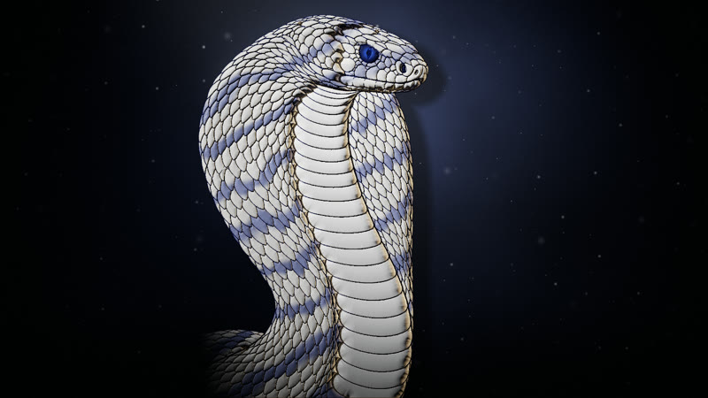 | 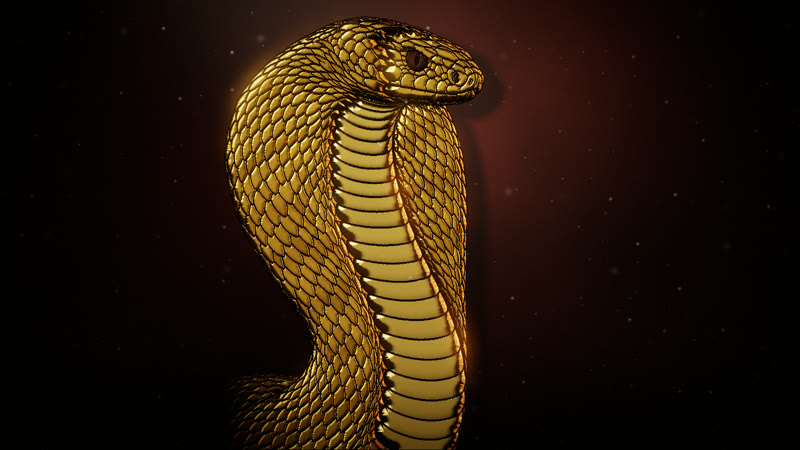 |

Quiet events happen every 20–90 seconds:

| 光带扫过 · a light bar sweeps past | 浮尘 · dust stirs in the light |
| --- | --- |
| 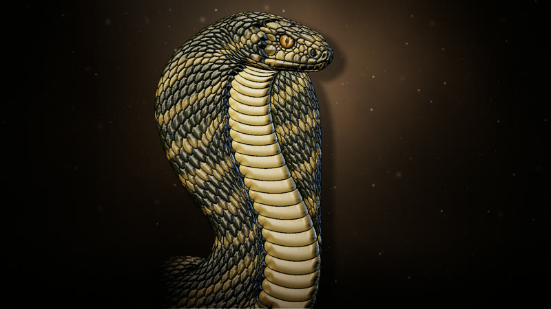 | 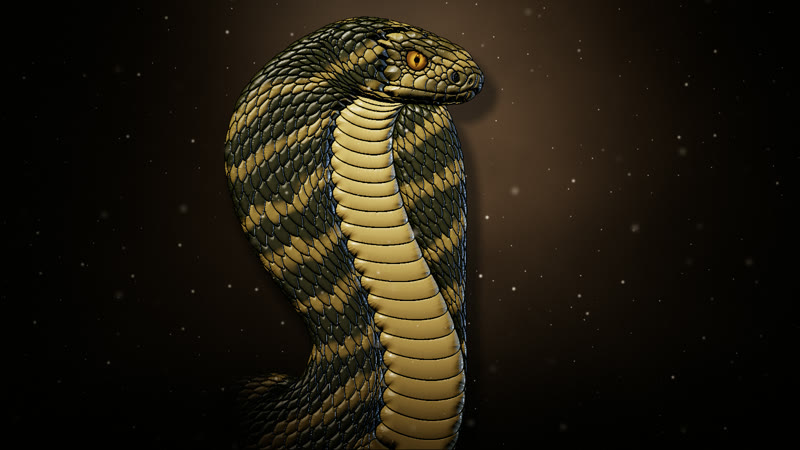 |

On a phone, it fills the portrait screen. Debug views show the traced blocks and the 3D surface:

| Portrait | `?view=ids` · one colour per scale | `?view=normals` · surface direction |
| --- | --- | --- |
| 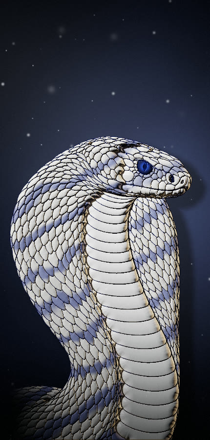 | 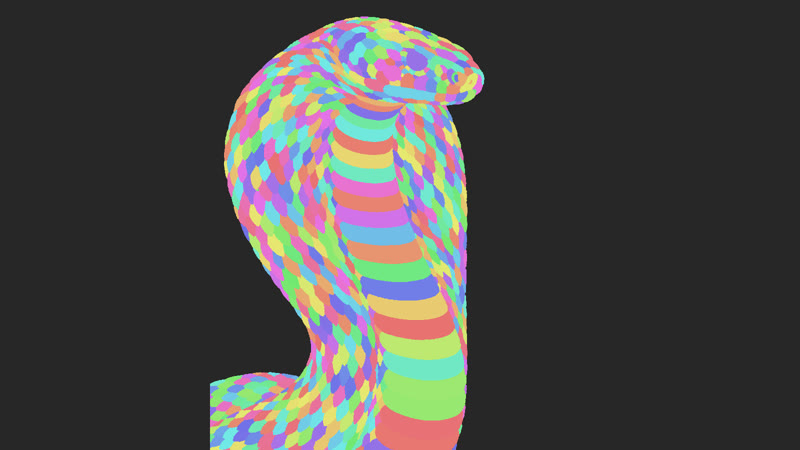 | 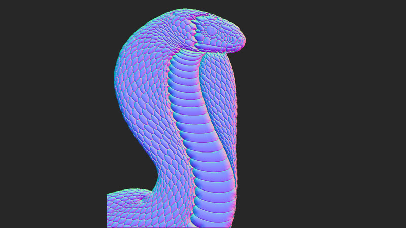 |

## Run

```bash
npm install
npm run dev      # local preview
npm run build    # static site in dist/, ready for any web host
npm run trace    # re-trace reference/cobra-lineart.png → src/art/cobra.svg
npm run snap -- "http://localhost:5173/?show&t=90" shot.png 1600 900   # headless screenshot
```

## Timelapse video

With `npm run dev` running, and with ffmpeg installed:

```bash
npm run timelapse                                   # 1 hour → 60 s video, 1920×1080, 30 fps
npm run timelapse -- --to 1800 --length 30 --out half-hour.mp4
npm run timelapse -- --url "http://localhost:5173/?seed=7" --size 1080x1920   # another hour, portrait
```

Each frame is rendered at an exact moment (`?capture` mode plus `renderAt(t)`), so the video doesn't depend on how fast your machine is. One hour at 1080p takes roughly 10 minutes.

## Put it on a website

`npm run build`, then copy `dist/` to any static host. The page uses relative paths, so any folder works. To place it inside another page:

```html
<iframe src="/cobra/index.html?show" style="width:100%;height:100vh;border:0" allow="fullscreen"></iframe>
```

Browsers without WebGL2 get the traced SVG in flat colours.

## Controls

| Key | Action |
| --- | --- |
| F / double-click | full screen (hides the HUD and the cursor) |
| H | tuning panel |
| Space | pause |
| M | next material |
| E | random event |

URL options: `?show` (start without HUD), `?t=600` (start 10 minutes in), `?seed=7` (another hour of events), `?mood=0…5` (lock a material), `?view=ids|distance|kinds|flow|normals|height` (debug views), `?panel` (open the panel).

## How it looks

- **Shape**: each body part is a rounded column. Each scale has a bevelled rim and a gentle dome, and the gaps between scales are grooves. Normals come from this height map.
- **Light**: a warm key light from the upper left, aimed at the head, plus a cool rim light from behind. Shading uses GGX highlights and studio softbox reflections. Scales cast short shadows on each other. The gaps get ambient occlusion and their own "cavity" colour.
- **Studio**: a mottled painted backdrop with a soft spotlight. The snake throws its shadow on it. A faint cone of light carries drifting dust. The cut-off body at the lower left sinks into the dark.
- **Materials** (`src/director/moods.ts`): 王蛇 natural olive and gold bands · 黑曜石 obsidian · 青铜 bronze with verdigris · 翡翠 jade · 青花 blue-and-white porcelain · 鎏金 gold.

## An hour without repeats

`src/director/director.ts` works out every frame from (seed, time) alone:

- **seconds**: dust drifts, and the backdrop's mottling slowly moves.
- **about 1 minute**: the key and rim lights wander on cycles of different lengths (97 s, 73 s, 61 s, 41 s), so their pattern never lines up the same way twice.
- **every 20–90 s**: one quiet event. 光带扫过 (a light bar passes), 鳞片起伏 (a ripple lifts the scales), 云影 (a shadow drifts across), 眼神 (the eye catches the light), or 浮尘 (dust stirs in the beam).
- **every 3–5 minutes**: the snake turns into a new material over about 40 s.

## Code map

- `scripts/trace.ts` + `scripts/trace/`: line art → blocks. The steps are ink mask, flood fill, sharing the ink between neighbours, smooth outlines, then sorting each block into a kind (`scale`, `ventral`, `head`, `eye`, `nostril`).
- `src/art/cobra.svg`: geometry and data only (`<path class="region ventral" data-cx data-cy d>` plus one ink path).
- `src/bake/`: runs once at load in a Web Worker. It draws an id map at 2×, distance-to-edge maps, and a float texture of per-block data.
- `src/shaders/scene.frag`: backdrop and snake in HDR. `bloom.frag`: soft glow. `post.frag`: tone mapping, vignette, grain.
- `src/gl/renderer.ts`: textures, uniforms, layout. The snake stands on the bottom edge, a little left of centre.
- `src/ui/`: tuning panel (lil-gui) and show mode.

## Reference

- `reference/cobra-lineart.png`: the line art that gets traced
- `reference/cobra-painting.png`: pose and composition reference
