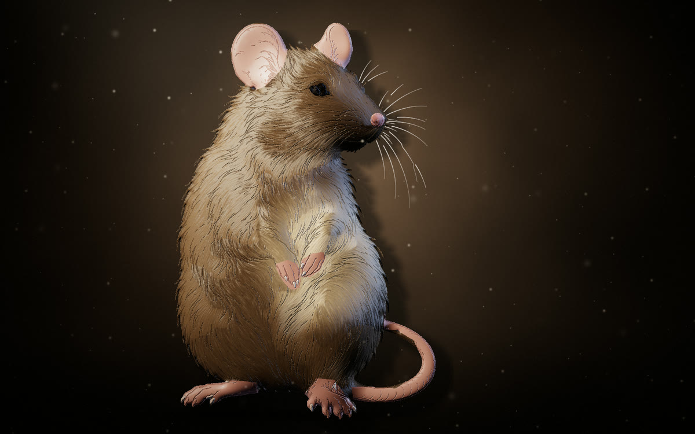
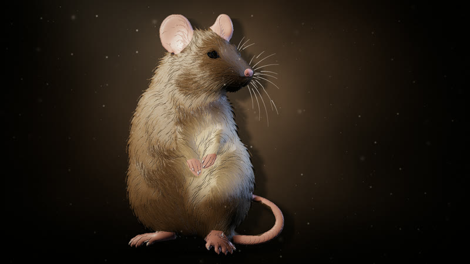
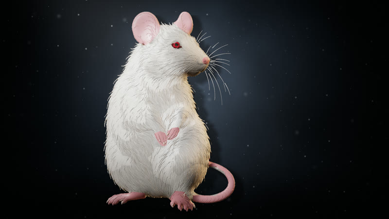
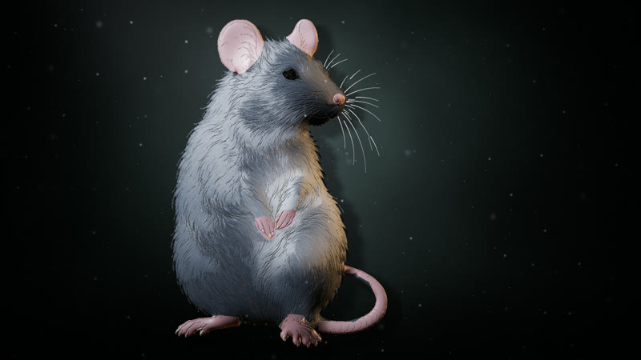
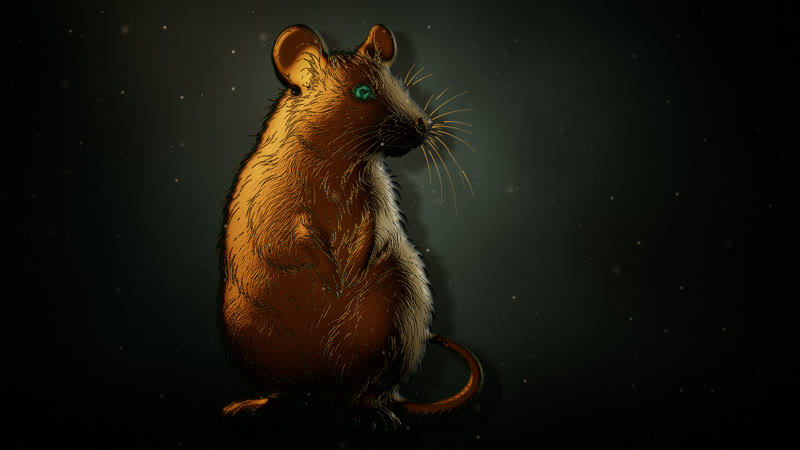
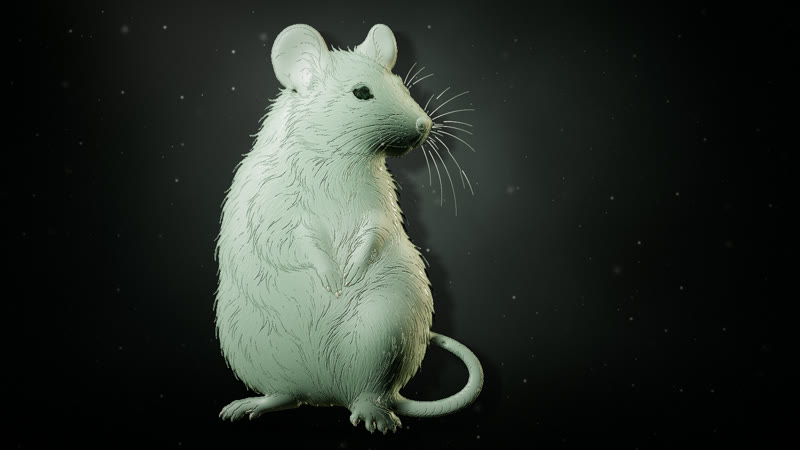
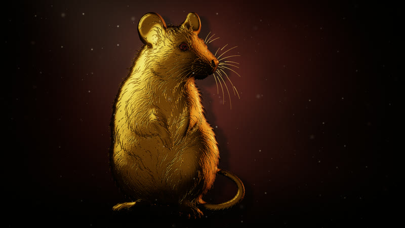
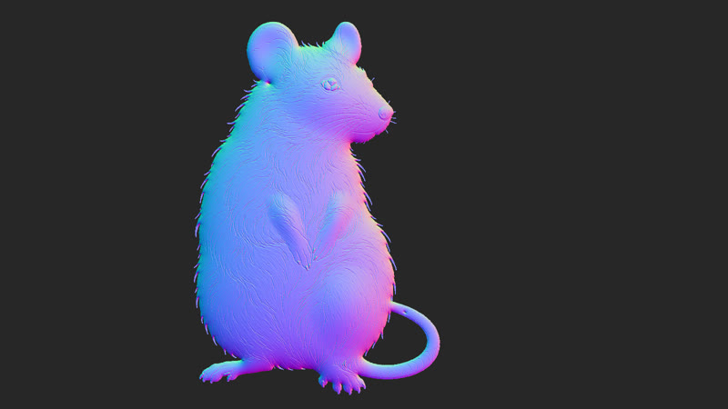
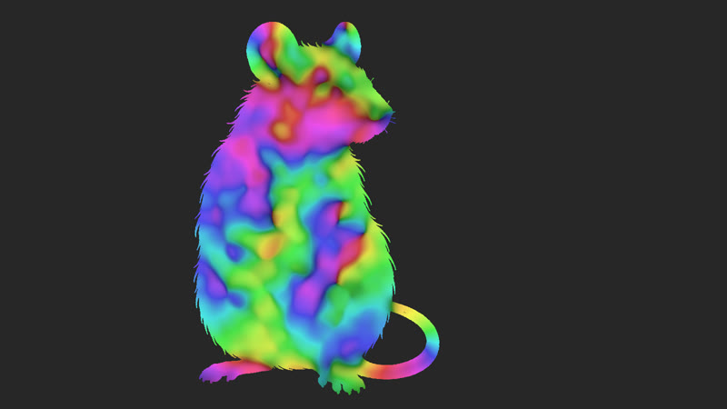

# Animal Studies: King Cobra and Rat

Animals lit like sculptures in a dark studio. Each line drawing is traced into SVG. WebGL2 then gives it real depth and light. The scene keeps changing for an hour or more without repeating.

There are two animals, and each one needs a different approach:

- **King cobra**: every scale in the drawing is a closed shape, so every scale becomes its own block with a bevel and a dome.
- **Rat**: the fur is drawn with open strokes. The outline is closed and inflated into one soft body. Fine hair strands follow the direction of the pen strokes, and the whiskers are lifted out as separate lines that move.

| King cobra (`?animal=cobra`, default) | Rat (`?animal=rat`) |
| --- | --- |
|  |  |

## Looks

Each animal slowly changes material every 3–5 minutes.

### King cobra

| 王蛇 · natural king cobra | 黑曜石 · obsidian | 青铜 · bronze |
| --- | --- | --- |
|  |  |  |
| **翡翠 · jade** | **青花 · blue-and-white porcelain** | **鎏金 · gold** |
|  |  |  |

### Rat

| 褐鼠 · brown rat | 白鼠 · white rat | 银灰 · silver rat |
| --- | --- | --- |
|  |  |  |
| **青铜 · bronze** | **青瓷 · celadon** | **鎏金 · gold** |
|  |  |  |

### Events

Quiet events happen every 20–90 seconds:

| 光带扫过 · a light bar sweeps past | 浮尘 · dust stirs in the light |
| --- | --- |
|  |  |

The rat also has 胡须抖动 (whiskers twitch), and 一阵风 (a gust ruffles the fur and the whiskers) instead of the cobra's scale ripple.

### Phone and debug views

On a phone, the animal fills the portrait screen. Debug views show the traced blocks and the 3D surface:

| Portrait | `?view=ids` · one colour per scale | `?view=normals` · surface direction |
| --- | --- | --- |
|  |  |  |
| | **Rat `?view=normals`** · inflated body, arm and haunch bulges, hair strands | **Rat `?view=flow`** · fur direction read from the pen strokes |
| |  |  |

## Run

```bash
npm install
npm run dev      # local preview
npm run build    # static site in dist/, ready for any web host
npm run trace -- cobra   # re-trace reference/cobra-lineart.png → src/art/cobra.svg
npm run trace -- rat     # re-trace reference/rat-lineart.png → src/art/rat.svg
npm run snap -- "http://localhost:5173/?show&t=90" shot.png 1600 900   # headless screenshot
```

The trace also writes `out/<animal>-preview.svg`, with each kind of block in its own colour (plus the rat's whiskers and volumes).

## Timelapse video

With `npm run dev` running, and with ffmpeg installed:

```bash
npm run timelapse                                   # 1 hour → 60 s video, 1920×1080, 30 fps
npm run timelapse -- --to 1800 --length 30 --out half-hour.mp4
npm run timelapse -- --url "http://localhost:5173/?animal=rat&seed=7" --size 1080x1920   # the rat, another hour, portrait
```

Each frame is rendered at an exact moment (`?capture` mode plus `renderAt(t)`), so the video doesn't depend on how fast your machine is. One hour at 1080p takes roughly 10 minutes.

## Put it on a website

`npm run build`, then copy `dist/` to any static host. The page uses relative paths, so any folder works. Each animal is a separate file that loads only when picked. To place it inside another page:

```html
<iframe src="/studies/index.html?animal=rat&show" style="width:100%;height:100vh;border:0" allow="fullscreen"></iframe>
```

Browsers without WebGL2 get the traced SVG in flat colours.

## Controls

| Key | Action |
| --- | --- |
| F / double-click | full screen (hides the HUD and the cursor) |
| H | tuning panel (also switches the animal) |
| Space | pause |
| M | next material |
| E | random event |

URL options: `?animal=cobra|rat`, `?show` (start without HUD), `?t=600` (start 10 minutes in), `?seed=7` (another hour of events), `?mood=0…5` (lock a material), `?view=ids|distance|kinds|flow|normals|height` (debug views), `?panel` (open the panel).

## How it looks

- **Shape, cobra**: each body part is a rounded column. Each scale has a bevelled rim and a gentle dome, and the gaps between scales are grooves.
- **Shape, rat**: the closed outline is inflated like a balloon (wide parts bulge, thin parts like the tail stay low). Soft extra bulges shape the head, arms and haunch, and the ears are flattened. Fine hair strands are drawn along the pen strokes (line integral convolution), and the strokes themselves become shallow grooves.
- **Light**: a warm key light from the upper left, aimed at the head, plus a cool rim light from behind. Shading uses GGX highlights and studio softbox reflections. Fur uses a Kajiya–Kay sheen that stretches across the hairs. The surface casts short shadows on itself. Gaps get ambient occlusion and their own "cavity" colour.
- **Whiskers**: drawn as thin strips over the scene. They drift slowly, sway in a gust, and twitch about 5 times a second during 胡须抖动.
- **Studio**: a mottled painted backdrop with a soft spotlight. The animal throws its shadow on it, and the rat has a soft contact shadow on the floor. A faint cone of light carries drifting dust. The cobra's cut-off body at the lower left sinks into the dark.

## An hour without repeats

`src/director/director.ts` works out every frame from (seed, time) alone:

- **seconds**: dust drifts, the backdrop's mottling slowly moves, and the whiskers drift.
- **about 1 minute**: the key and rim lights wander on cycles of different lengths (97 s, 73 s, 61 s, 41 s), so their pattern never lines up the same way twice.
- **every 20–90 s**: one quiet event, chosen from the animal's own list.
- **every 3–5 minutes**: the animal turns into a new material over about 40 s.

## Code map

- `scripts/trace.ts`: picks the animal. `scripts/trace/cobra.ts` and `scripts/trace/rat.ts` hold each animal's steps and hand-placed landmarks. `scripts/trace/output.ts` and `raster.ts` are the shared steps: ink mask, flood fill, outlines, and writing the SVG.
- `src/art/*.svg`: geometry and data only. Regions (`<path class="region fur|skin|scale|…">`), one ink path, and for the rat, volumes and whisker lines.
- `src/subjects/`: one file per animal, holding its art, materials, layout, landmarks and events.
- `src/bake/`: runs once at load in a Web Worker. `bake.ts` draws an id map at 2×, distance maps, per-block data and the body height. `form.ts` handles balloon inflation, stroke direction and hair strands.
- `src/shaders/scene.frag`: backdrop and animal in HDR. `whisker.vert/.frag`: moving whiskers. `bloom.frag`: soft glow. `post.frag`: tone mapping, vignette, grain.
- `src/gl/renderer.ts`: textures, uniforms, layout, whisker strips.
- `src/ui/`: tuning panel (lil-gui) and show mode.

## Reference

- `reference/cobra-lineart.png`, `reference/rat-lineart.png`: the line art that gets traced
- `reference/cobra-painting.png`: pose and composition reference for the cobra
